<!-- Local assets: build-profile.py; contribution arcade: build-contribution-game.py -->
<picture>
  <source media="(prefers-color-scheme: light)" srcset="./assets/hero-light.svg" />
  
</picture>

   
  
  &nbsp;
  

 

### `01` / TECH STACK

  
<b>LANGUAGES</b>

<picture>
  <source media="(prefers-color-scheme: light)" srcset="https://skillicons.dev/icons?i=js,ts,cs&amp;theme=light" />
  
</picture>
  
JavaScript · TypeScript · C#

  
<b>FRONTEND</b>

<picture>
  <source media="(prefers-color-scheme: light)" srcset="https://skillicons.dev/icons?i=react,nextjs,redux,tailwind,html,css&amp;theme=light" />
  
</picture>
  
React · Next.js · Redux Toolkit · Tailwind CSS · HTML5 · CSS3 · Responsive Design

  
<b>BACKEND</b>

<picture>
  <source media="(prefers-color-scheme: light)" srcset="https://skillicons.dev/icons?i=nodejs,nestjs,dotnet,prisma&amp;theme=light" />
  
</picture>
  
Node.js · NestJS · ASP.NET Core (.NET 8) · RESTful APIs · JWT · Socket.IO · Prisma

  
<b>DATA</b>

<picture>
  <source media="(prefers-color-scheme: light)" srcset="https://skillicons.dev/icons?i=postgres,mysql,redis&amp;theme=light" />
  
</picture>
  
PostgreSQL · PostGIS · SQL Server · MySQL · Redis · Neo4j

  
<b>ENGINEERING</b>

<picture>
  <source media="(prefers-color-scheme: light)" srcset="https://skillicons.dev/icons?i=git,github,docker,githubactions,postman,linux&amp;theme=light" />
  
</picture>
  
Git/GitHub · Docker · Docker Compose · GitHub Actions · CI · Integration Testing · Postman · Linux

 

### `02` / GITHUB TELEMETRY

  <picture>
    <source media="(prefers-color-scheme: light)" srcset="https://streak-stats.demolab.com/?user=dhuyhoang1406&amp;hide_border=true&amp;background=EDF3FC&amp;ring=7951D0&amp;fire=138467&amp;currStreakLabel=087D9D&amp;sideLabels=546C89&amp;currStreakNum=172B47&amp;sideNums=172B47&amp;dates=546C89&amp;card_width=1180" />
    
  </picture>
   
  <picture>
    <source media="(prefers-color-scheme: light)" srcset="https://github-readme-stats.vercel.app/api?username=dhuyhoang1406&amp;show_icons=true&amp;hide_rank=true&amp;hide_border=true&amp;title_color=087D9D&amp;icon_color=7951D0&amp;text_color=546C89&amp;bg_color=EDF3FC" />
    
  </picture>
  <picture>
    <source media="(prefers-color-scheme: light)" srcset="https://github-readme-stats.vercel.app/api/top-langs/?username=dhuyhoang1406&amp;layout=compact&amp;langs_count=8&amp;hide_border=true&amp;title_color=087D9D&amp;text_color=546C89&amp;bg_color=EDF3FC" />
    
  </picture>

### `03` / CONTRIBUTION DEFENDER

<b>One day. One energy tile. A year of missions.</b> 
A spaceship harvests contribution energy and blasts pixel viruses — on autopilot.

<picture>
  <source media="(prefers-color-scheme: light)" srcset="./assets/contribution-defender-light.svg" />
  
</picture>

Brighter tiles = more contributions · Animated replay · Calendar updates daily through GitHub Actions

 

<picture>
  <source media="(prefers-color-scheme: light)" srcset="./assets/footer-light.svg" />
  
</picture>
